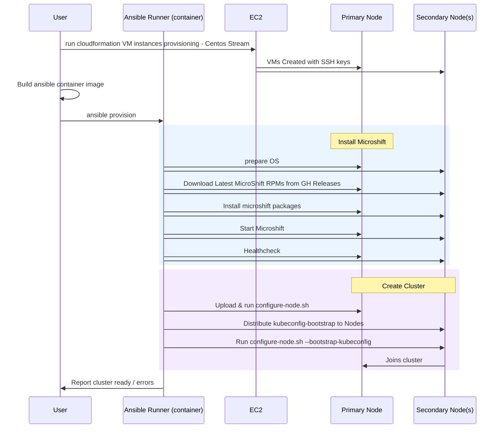

## MicroShift cluster automation with Ansible

This directory contains a minimal workflow to build an Ansible runner container, prepare an inventory, install upstream MicroShift on target nodes, and join them into a single cluster.

### Workflow



#### 1. Infrastructure Setup
- User provisions EC2 VM instances using CloudFormation with CentOS Stream
- VMs are created with SSH keys for access
- User builds the Ansible runner container image locally
#### 2. MicroShift Installation
- Ansible runner prepares the operating system on both primary and secondary nodes
- Downloads latest MicroShift RPM packages from GitHub releases
- Installs MicroShift packages on all nodes
- Starts the MicroShift service on all nodes
- Performs health checks to verify installation success
#### 3. Cluster Formation
- Ansible runner uploads and executes configure-node.sh script on primary node
- Distributes kubeconfig-bootstrap files to secondary nodes
- Executes configure-node.sh with bootstrap-kubeconfig on secondary nodes
- Secondary nodes join the cluster by connecting to the primary node
- Ansible runner reports final cluster status (ready/errors) back to user
  The entire process is orchestrated through the containerized Ansible runner, which manages parallel operations across multiple nodes to create a functional MicroShift cluster.

### Prerequisites
- **Podman** installed on your workstation.
- **SSH access** from your workstation to all target VMs.
  - Public keys should be present in `~/.ssh/` and trusted by the target hosts.
  - Passwordless sudo on the target hosts is recommended for automation.
- Target hosts are reachable by DNS or IP and allow inbound SSH.
- **Note:** This workflow assumes that your target nodes are running **CentOS Stream 9** as the operating system.

### Build the Ansible runner image (Podman)
Build the container that bundles Ansible and playbooks in this repo:

```bash
podman build -f ansible-runner.Containerfile -t ansible-runner:latest .
```

### Create the Ansible inventory
Create an `inventory` file in `cluster/` directory with your managed hosts. Example:

```ini
[remote]
192.168.1.22 ansible_connection=ssh ansible_user=ec2-user role=primary
192.168.1.23 ansible_connection=ssh ansible_user=ec2-user role=secondary
```

Notes:
- `ansible_user` must exist on the host and have sudo privileges.
- `role` is used by the playbooks to distinguish the primary node from secondaries.
- This setup assumes SSH keys are available at `~/.ssh/` on your workstation.

### Install latest upstream MicroShift on all nodes
This will install Microshift in all the configured nodes in parallel.

```bash
podman run -ti \
  -v ~/.ssh:/home/runner/.ssh:Z \
  -v "$PWD/cluster":/runner:Z \
  -v "$PWD/roles":/runner/roles:Z \
  ansible-runner:latest \
  ansible-playbook -i /runner/inventory /runner/install.yaml
```

### Join nodes into a single cluster
After installation, run the join procedure to form a cluster with the designated primary.

```bash
podman run -ti \
  -v ~/.ssh:/home/runner/.ssh:Z \
  -v "$PWD/cluster":/runner:Z \
  -v "$PWD/roles":/runner/roles:Z \
  ansible-runner:latest \
  ansible-playbook -i /runner/inventory /runner/join.yaml
```

### Verify the cluster
Once the join completes, log into the primary node and run the following commands to verify the cluster is up and running:

```bash
mkdir -p ~/.kube
sudo cat /var/lib/microshift/resources/kubeadmin/kubeconfig > ~/.kube/config
kubectl get nodes -o wide
kubectl get pods -A
```

### Troubleshooting
- If SSH fails inside the container, confirm `~/.ssh` is mounted and permissions are preserved.
- Ensure security contexts on volumes are correct (note the `:Z` label in `-v` mounts when using SELinux).
- Validate inventory hostnames/IPs resolve from your workstation.

### Cleanup (optional)
To remove the built image locally:

```bash
podman rmi ansible-runner:latest
```
